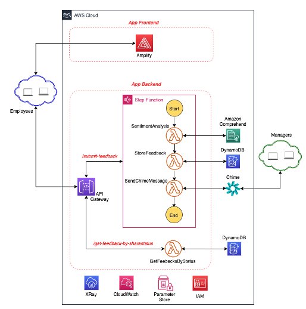

# AWS Serverless Feedback App

**Status**: _Completed. Please create issues or pull requests if you have ideas for improvement._

The **Serverless Feedback App** is a simple web application that was developed to provide a mechanism for employees to provide feedback to their managers. Given the COVID-19 global pandemic and with remote working becoming the norm, managers need a way to get feedback from their direct reports anytime from anywhere to ensure employees are supported and engaged. There are so many ways of building an app like this on AWS so the key aim is to showcase how some of the AWS serverless services have been used to develop this app which hopefully will help educate and provide guidance on how to use these services for developing other use cases.

**Key Learning Areas**

- Invoking an API Gateway Endpoint from a React App
- Hosting a React App on AWS Amplify
- Deploying a React App on AWS Amplify using AWS CDK
- Building a Serverless Application with AWS SAM
- Orchestrating Lambda Functions with AWS Step Function
- Sentiment Analysis with Amazon Comprehend SDK
- Notification via Integration with Chime Webhooks
- Building a CI/CD Pipeline with AWS CDK
- Tracing API Gateway, Step Function and Lambda Functions with AWS X-Ray
- Lambda Cost and Performance Tunning with AWS Lambda Power Tools

**This sample is not meant to be used as production as-is, but as an inspiration on how to leverage serverless services to build a simple application.**

_Please note that you may incure AWS charges for deploying the feedback application into your AWS account as not all services used are part of the [free tier](https://aws.amazon.com/free/) and you might exceed the free tier usage limit. To track costs in your AWS account, consider using [AWS Cost Explorer](https://aws.amazon.com/aws-cost-management/aws-cost-explorer/) and [AWS Billing and Cost Management](https://docs.aws.amazon.com/awsaccountbilling/latest/aboutv2/billing-what-is.html). You can also set up a [budgets](https://aws.amazon.com/aws-cost-management/aws-budgets/) to get notified of when actual or forecasted cost and usage exceed your budget threshold._

## Architecture

### High-level architecture

This is a high-level view of the feedback application indicating both the frontend and backend with the interconnection between the services.

  

### Technologies used

**Frontend App Hosting**:

- [AWS Amplify](https://aws.amazon.com/amplify/) for hosting the frontend React JS application. Amplify provides the storage and global content distribtion together with a CI/CD pipeline to deploy new changes to the frontend.

**API Hosting**:

- [Amazon API Gateway](https://aws.amazon.com/api-gateway/) for service-to-service synchronous communication (request/response).

**Identity Management**:

- [AWS Identity and Access Management](https://aws.amazon.com/iam/) for service-to-service authorization for example; granting a Lambda function the permission to interact with DynamoDB, Amazon Comprehend, Parameter Store or pushing metrics to Amazon X-Ray.

**Compute**:

- [AWS Lambda](https://aws.amazon.com/lambda/) as serverless compute either behind APIs or to react to asynchronous events.

**Microservice Orchestration**:

- [AWS Step Functions](https://aws.amazon.com/step-functions/) used to orchestrate the serverless function that makes it easy to sequence AWS Lambda functions and multiple AWS services into business-critical applications.

**Storage**:

- [Amazon DynamoDB](https://aws.amazon.com/dynamodb/) as a scalable NoSQL database for persisting informations.

**CI/CD**:

- [AWS Cloud Development Kit (CDK)](https://aws.amazon.com/cdk/) for defining AWS resources as code in the [payment-3p](payment-3p/) service.
- [Amazon CodeCommit](https://aws.amazon.com/codecommit/) as a repository to trigger the CI/CD pipeline.
- [Amazon CodeBuild](https://aws.amazon.com/codebuild/) for building artifacts for microservices.
- [Amazon CodePipeline](https://aws.amazon.com/codepipeline/) for orchestrating the CI/CD pipeline to production.

**Monitoring**:

- [Amazon CloudWatch](https://aws.amazon.com/cloudwatch/) for metrics, dashboards, log aggregation.
- [AWS X-Ray](https://aws.amazon.com/xray/) for tracing across AWS services and across microservices.

**Sentiment Analysis**:

- [Amazon Comprehend](https://aws.amazon.com/comprehend/) a natural language processing (NLP) service that uses machine learning to find insights and relationships in text. The service is used for sentiment analysis of the feedback comments to identify if the comments are POSITIVE, NEGATIVE OR NEUTRAL

**Notification**:

- [Amazon Chime](https://aws.amazon.com/chime/) used for notifying the managers on a managers only chime chat room once a new feedback is submitted by employees

**Key Value Store**:

- [AWS Systems Manager Parameter Store](https://docs.aws.amazon.com/systems-manager/latest/userguide/sysman-paramstore.html) used for storing the Chime WebHook url for the managers chime chat room

## Documentation

To get started, see the [getting started guide](docs/getting_started.md) to setup the project

A detailed documentation of the app can be found in the [docs](docs/) folder

The list of known issues is maintained [here](docs/known_issues.md)

## Contributing

See the [contributing](CONTRIBUTING.md)

## License

This library is licensed under the MIT-0 License. See the LICENSE file.
