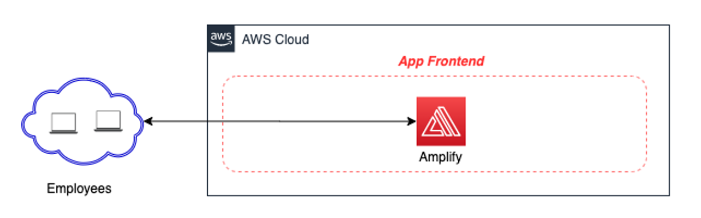

# Documentation

## How do I use it?

- [Getting started](getting_started.md): instructions to setup the project

## How does it work?

- Deep Dive on the Frontend

  - Overview of Architecture
    

        
    

  - Development Framework
    

        
    

  - Infrastructure as Code
  - Hosting on AWS Amplify

- Deep Dive on the Backend

  - Overview of Architecture
    

        
    

  - Integration with Chime
  - Integration with Parameter Store
  - Infrastructure as Code
  - CI/CID Pipeline
    

        
    

  - Logging and Monitoring
    

        
    

  - Cost and Performance Tunning
    

        
    

    

        
    

