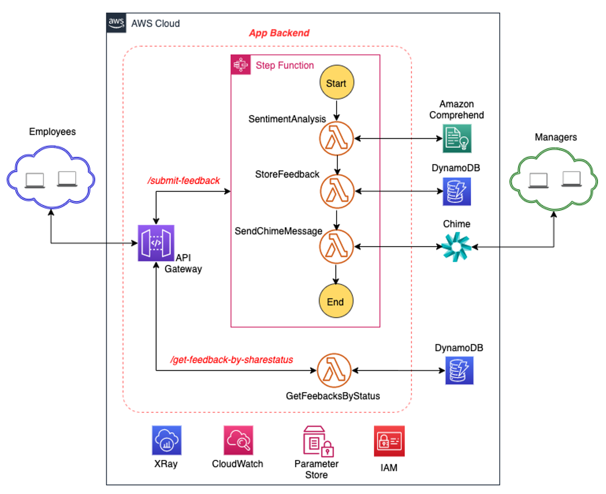
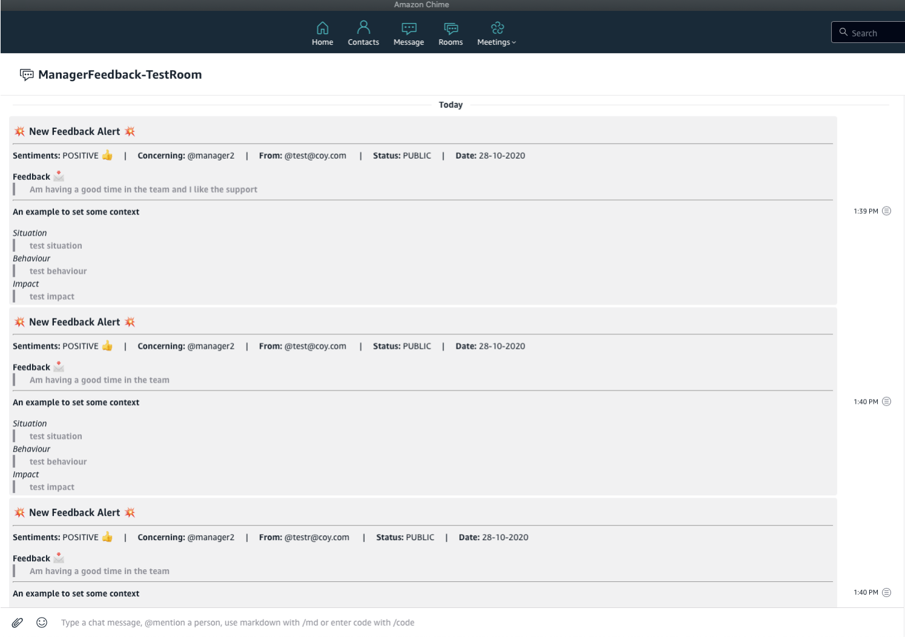
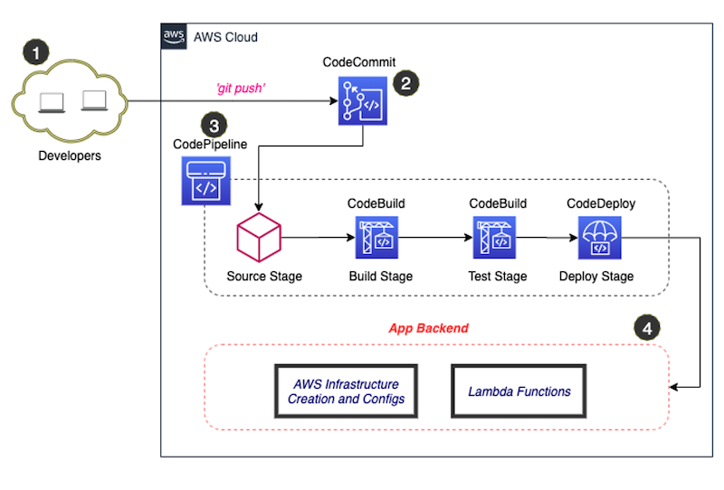
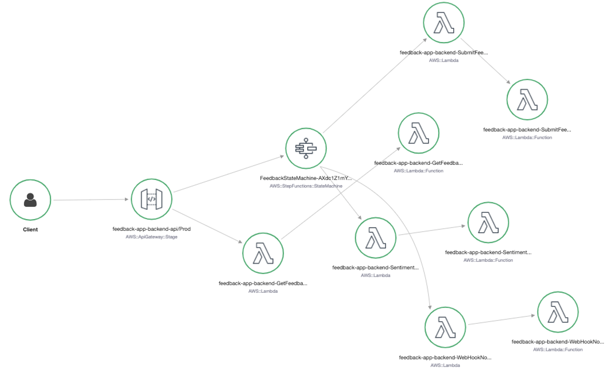
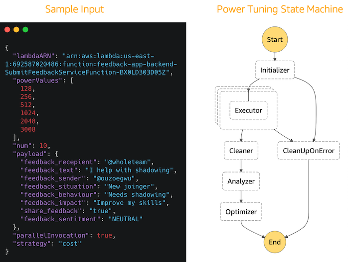
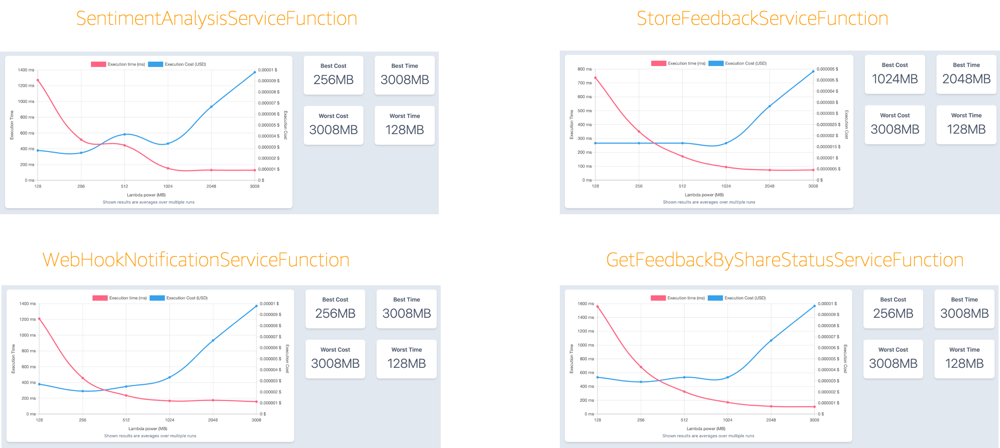

- ### Deep Dive on the Backend

  - #### Overview of Architecture

    

        
    

    The backend API exposes two resources:

    1. /submit-feedback, a POST method for submitting a new feedback
    2. /get-feedback-by-sharestatus, a GET method for retreiving feedback based on the whether it is public or private

    **`Submit Feedback`**

    A feedback submission from the frontend triggers the invokes the /submit-feedback api which triggers an AWS Step Function. The purpose of the step function is to orchestrate the lambda functions created to process a new feedback submission. The 3 lambda function for processing feedback carry out the following:

    1. Sentiment Analysis - the feedback comment is analysed usings Amazon Comprehend which returns either "POSITIVE", "NEGATIVE" or "NEUTRAL" depending on the sentimemnts on the feedback. This is achieved using Amazon Comprehend SDK.
    2. Persisting Feedback - the feedback details together with the output of the sentiment analysis is stored in DynammoDB using the SDK
    3. Notification - the feedback details is formated with markdown and sent to the manager chime room via webhook.

    **`Public Feedback`**

    The public feedbacks are the feedbacks that the employee have indicated can be shared while submitting the feedback. A Global Secondary Index is created in DynamoDB with the share_feedback attribute set as the partition key. Using DynamoDB SDK, a call is made to the database to retrieve the public feedbacks.

  - #### Integration with Chime

    Follow the instruction [here](https://docs.aws.amazon.com/chime/latest/ug/webhooks.html) to create a webhook for a chime room. The webhook URL is stored in AWS Paramter Store, a default value (which needs to be updated) is specified in the SAM template [here](../feedback-app-backend/template.yaml). Update the SAM template with the webhook URL and run the commands below to build and deploy the changes.

    - **`cd /home/ec2-user/environment/aws-serverless-feedback-app/feedback-app-backend/`**
    - **`sam build`**
    - **`git add .`**
    - **`git commit -m "updated webhook url"`**
    - **`git remote add codecommit codecommit::eu-west-1://feedback-app-repo-backend`**
    - **`git push -u codecommit master`**

    The template for the markdown formatting to display the notification as show below can be found [here](../feedback-app-backend/webhooknotification-service/resources/chime_message_template.txt)

    

        
    

  - Integration with Parameter Store
  - Infrastructure as Code
  - CI/CID Pipeline
    

        
    

  - Logging and Monitoring
    

        
    

  - Cost and Performance Tunning
    

        
    

    

        
    

