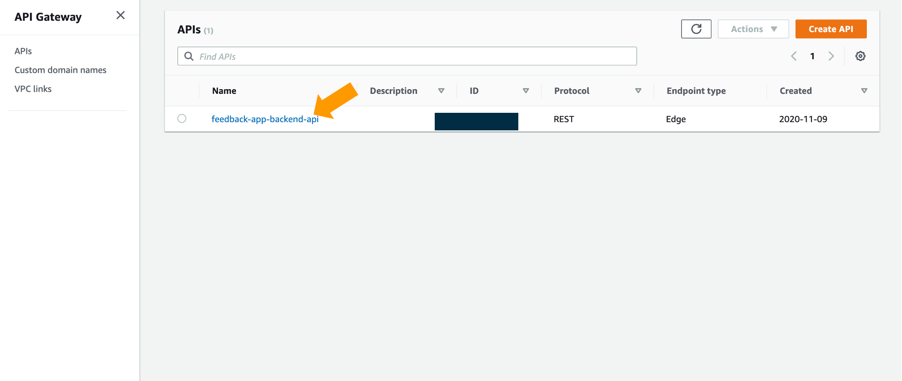
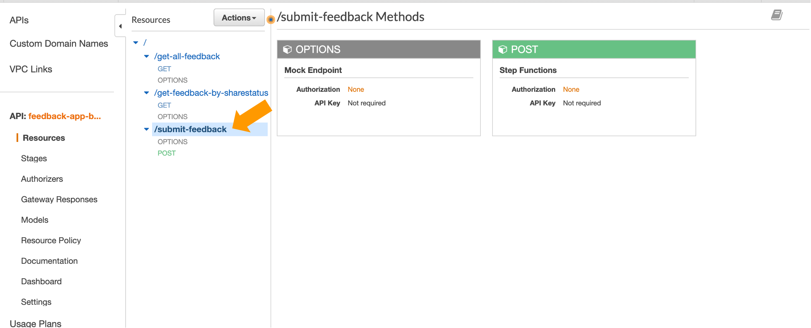
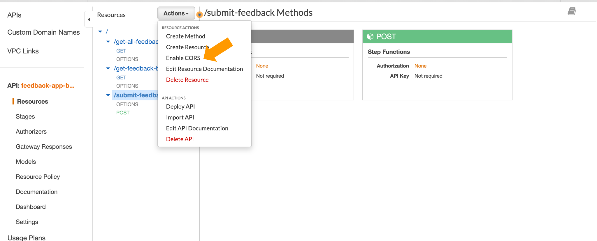
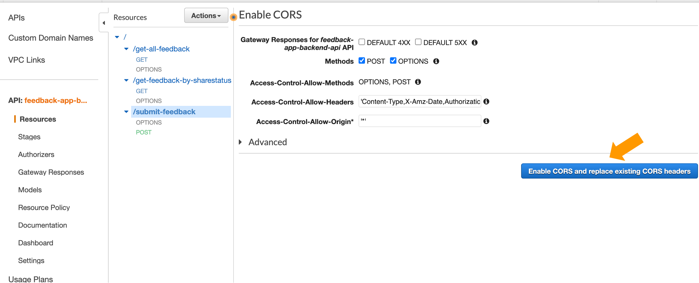
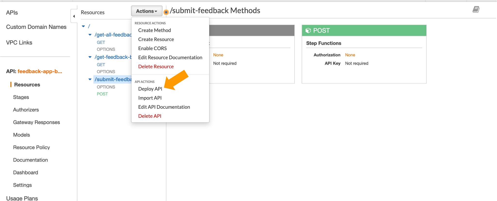
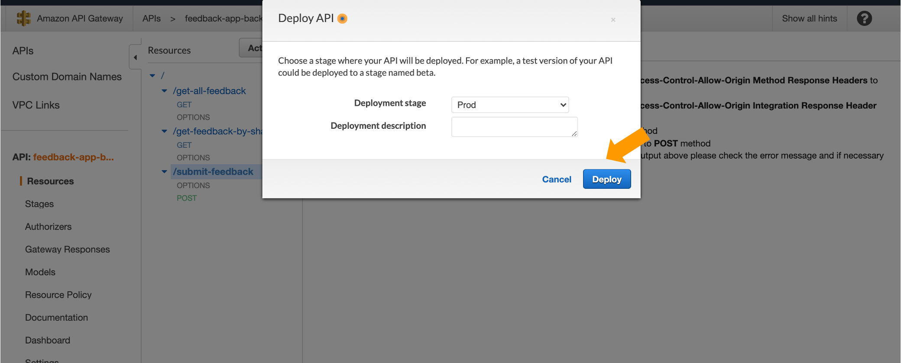

- ### Common Issues

  - #### Error message "Oops! A little glitch, can you try again please!" returned while submitting a feedback

    - #### Resolution

    1. Navigate to the API Gateway Console
    

      
    

    2. Select the /submit-feedback API
    

      
    

    3. Via the Action Menu, select the "Enable CORS"
    

      
    

    4. Select "Enable CORS and replace existing CORS headers"
    

      
    

    5. Via the Action Menu, select the "Deploy API"
    

      
    

    6. Select "Prod" as the Deployment stage and select "Deploy"
    

      
    

