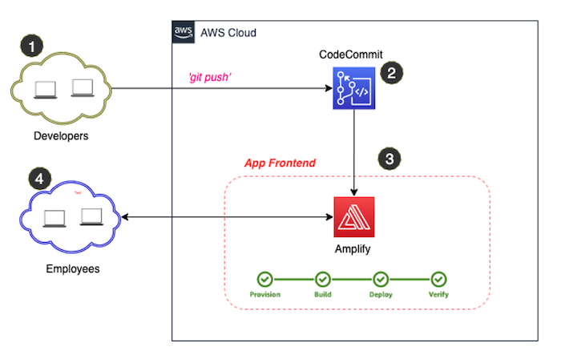

- ### Deep Dive on the Frontend

  - #### Overview of Architecture

    The frontend is a [React](https://reactjs.org/) application and the UI developed with [Ant Design](https://ant.design/). AWS CodeCommit and AWS Amplify are the two services used for source control and application hosting respectively. Once a code is committed to CodeCommit via `git push`, Amplify automatically forks the code from the repository and triggers a CI/CD pipeline fully managed by Amplify to deploy the changes. The build settings for the CI/CD pipeline can be specified in an "amplify.yml" file stored in the root folder of the repository.

    <p align="center">
        
    </p>

  - #### Hosting on AWS Amplify

    [AWS Amplify](https://aws.amazon.com/amplify/) provides developers with a set of tools and services to build secure and scalable full stack cloud applications. One of the tools is the AWS Amplify Console that provides a GUI with a git-based workflow for hosting web applications, with a fully managed underlying storage and global content distribition. Applications can be deployed by connecting to an existing repository (GitHub, BitBucket Cloud, GitLab and AWS CodeCommit) to set up a fully managed continuous deployment pipeline. Subsequently, any changes committed to the repository will trigger the pipeline to build, test and deploy the changes to the target environment. It also provides instant content delivery network (CDN) cache invalidation, atomic deploys, custom domains, password protection, and redirects without the need to manage any servers.

  - #### Invoking the Backend API

    To invoke the backend API, ensure the API url is setup correctly in the [constants.json](../feedback-app-frontend/src/global/constants.json) file. The details of how to retrieve the url to use is explained in the [getting started guide](getting_started.md). The backend API is invoked from the frontend to:

    1. Submit a new feedback
    2. Retrieve public feedbacks

    The code snippet below shows how the api is invoked within the [SubmitFeedback.js](../feedback-app-frontend/src/components/SubmitFeedback.js) and [PublicFeedback.js](../feedback-app-frontend/src/components/PublicFeedback.js) files.

    **`SubmitFeedback.js`**

    ```javascript
    onFinish = (values) => {
      console.log(values);
      axios
        .post(
          Constants.feedback_api_url + Constants.submit_feedback_path,
          {
            feedback_recepient: values.feedbackRecipientFormItem,
            feedback_text: values.feedbackTextFormItem,
            feedback_sender:
              values.feedbackSenderFormItem === ""
                ? "anonymous"
                : "@" + values.feedbackSenderFormItem,
            feedback_situation: values.feedbackSituationFormItem,
            feedback_behaviour: values.feedbackBehaviourFormItem,
            feedback_impact: values.feedbackImpactFormItem,
            share_feedback:
              this.state.shareFeedback === true ? "true" : "false",
          },
          {
            headers: {
              "Content-Type": "application/json",
            },
          }
        )
        .then((res) => {
          console.log("successfully added feedback");
          message.success("Feedback received... Thank You!");
          this.formRef.current.resetFields();
        })
        .catch((err) => {
          console.log("error saving to database");
          message.error("Oops! A little glitch can you try again please!");
        });
    };
    ```

    **`PublicFeedback.js`**

    ```javascript
        constructor(props) {
            super(props);
            axios
            .get(
                Constants.feedback_api_url +
                Constants.get_feedback_by_status_path +
                Constants.parameter_for_public_feedback
            )
            .then((res) => {
                this.setState({ publicFeedbacks: res.data });
                this.populateTable();
            })
            .catch((err) => {
                message.error(
                "Oops! A little glitch retrieving feedbacks. Try again please!"
                );
                console.log(err);
            });
        }
    ```

  - #### Infrastructure as Code

    The AWS resources used to deploy the frontend application is managed using [AWS Cloud Development Kit (CDK)](https://aws.amazon.com/cdk/). AWS CDK is an open source software development framework which can be used to model and provision your cloud application resources using familiar programming languages, including TypeScript, JavaScript, Python, C# and Java.

    Setting up the frontend application starts with deploying the CDK application to create the CodeCommit repository and the Amplify application. One of the key configuration while creating the Amplify application via CDK is to setup the CodeCommit repository as the source code provider for the Amplify application. This will ensure that any code committed to the repository triggers the Amplify managed CI/CD pipeline to deploy the changes. The CDK application source code folder can be found [here](../feedback-app-frontend/amplify-infra-code/) and the typescript code is show below.

    ```typescript
    import * as cdk from "@aws-cdk/core";
    import * as codecommit from "@aws-cdk/aws-codecommit";
    import * as amplify from "@aws-cdk/aws-amplify";
    import * as iam from "@aws-cdk/aws-iam";
    import Constants from "../global/constants.json";

    export class AmplifyInfraCodeStack extends cdk.Stack {
      constructor(scope: cdk.Construct, id: string, props?: cdk.StackProps) {
        super(scope, id, props);

        // The code that defines your stack goes here
        const feedbackAppFrontEndRepo = new codecommit.Repository(
          this,
          "FeedbackAppFrontEndRepo",
          {
            repositoryName: Constants.code_commit_repo_name,
            description: "The repository for the frontend of the feedback app",
          }
        );

        const amplifyRole = new iam.Role(
          this,
          "Feedback-App-Frontend-AmplifyRole",
          {
            assumedBy: new iam.ServicePrincipal("amplify.amazonaws.com"),
            description: "The to be used by amplify to deploy the application",
            roleName: Constants.amplify_role_name,
          }
        );

        const feedbackFrontendApp = new amplify.App(
          this,
          Constants.amplify_app_name,
          {
            sourceCodeProvider: new amplify.CodeCommitSourceCodeProvider({
              repository: feedbackAppFrontEndRepo,
            }),
            role: amplifyRole.withoutPolicyUpdates(),
          }
        );

        amplifyRole.addToPolicy(
          new iam.PolicyStatement({
            actions: ["*"],
            resources: ["*"],
          })
        );

        const masterBranch = feedbackFrontendApp.addBranch("master");
      }
    }
    ```
