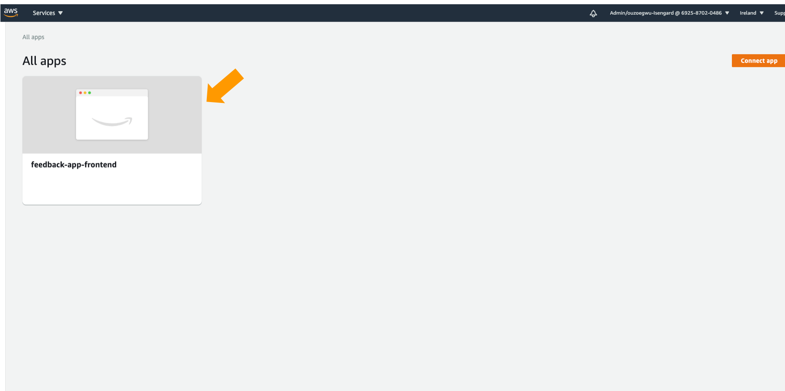
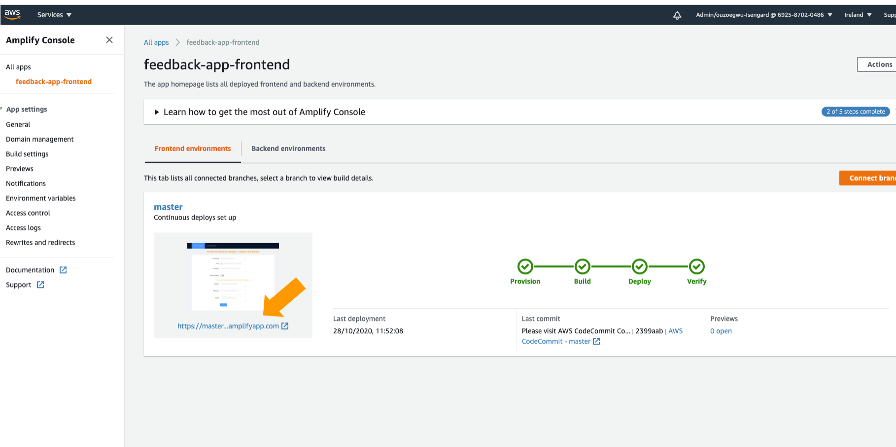
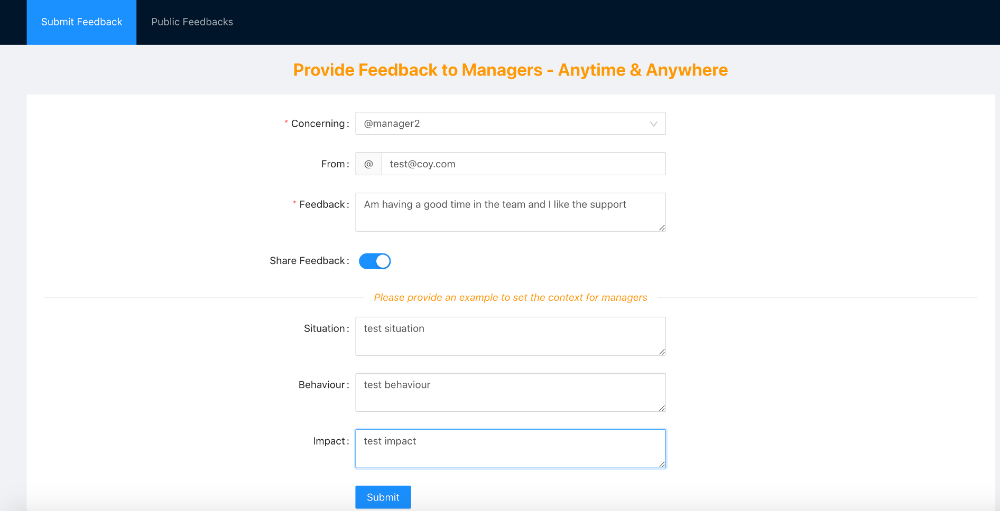
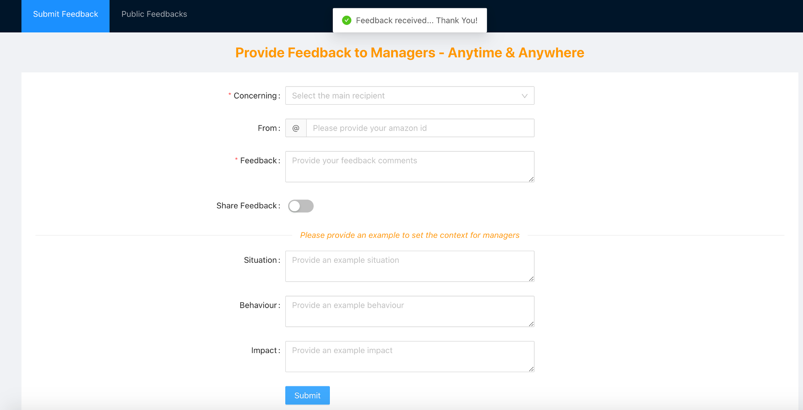
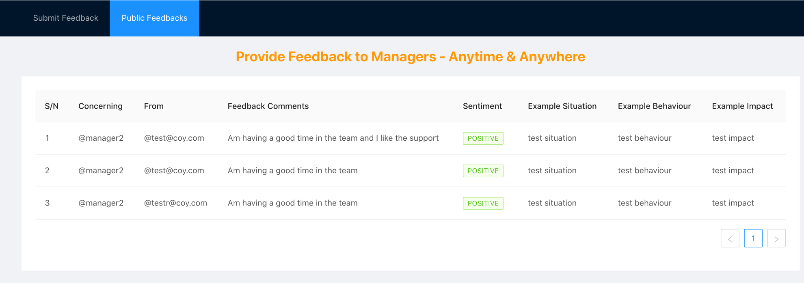

# Getting started

## Contents

- ### Step 1 - Setting up the Backend

- ### Step 2 - Setting up the Frontend

- ### Step 3 - Accessing the Application

- ### Step 4 - Clean Up

###

## Step 1 - Setting up the Backend

The following steps can be used to deploy the frontend:

1. Launch an AWS Cloud9 environment following the instructions in the link below

- [Launch AWS Cloud9 Environment](https://docs.aws.amazon.com/cloud9/latest/user-guide/create-environment-main.html) (Note: While creating the Cloud9 Environment, complete Step 1 and use default settings for Step 2 and Step 3)

2. Clone the aws-serverless-feedback-app project (Optional if the repository has not yet been cloned as part of setting up the Frontend)

- **`git clone https://github.com/aws-samples/aws-serverless-feedback-app.git`**

3. Navigate to the CDK Application to that will be used to create the CI/CD pipeline which consists of the following resources: Amazon CodePipeline, Amazon CodeCommit, Amazon CodeBuild and Amazon CodeDeploy

- **`cd /home/ec2-user/environment/aws-serverless-feedback-app/feedback-app-backend/cicd-pipeline/`**

4. Install the packages required by the CDK Application (ignore any the warnings)

- **`npm install`**

5. Build the CDK Application

- **`npm run build`**

6. Deploy the CDK Application (Note: Ensure there is no existing AWS resource with the same name specified in the file aws-serverless-feedback-app/feedback-app-backend/cicd-pipeline/global/constant.json )

- **`cdk deploy --require-approval never`**

7. Navigate back to the feedback-app-backend folder

- **`cd /home/ec2-user/environment/aws-serverless-feedback-app/feedback-app-backend/`**

8. Run the following git commands to commit code to the CodeCommit repository created in 5 above

- **`git init`**
- **`git add .`**
- **`git commit -m "first commit"`**
- **`git remote add codecommit codecommit::{region}://feedback-app-repo-backend`**
- **`git push -u codecommit master`**

9. Identify the url for the API Gateway (Note: The API gateway will take some time (approx. 5 mins) to be created after committing the code so run the command multiple times until the API name is visible)

- **`aws apigateway get-rest-apis`**
  From the response look for the API with the name "feedback-app-backend-api" and identify the corresponding API ID. Replace the API ID and the corresondpong AWS region in the URL "https://[api_id].execute-api.[aws_region].amazonaws.com/Prod/". This will be the feedback app backend api and will be used while setting up the frontend.

## Step 2 - Setting up the Frontend

The following steps can be used to deploy the **frontend after setting up the backend**:

1. Update the Backend API URL in the "constants.json" file

- **`cd /home/ec2-user/environment/aws-serverless-feedback-app/feedback-app-frontend/src/global`**
- **`vim constants.json`** (Update the value for "feedback_api_url" retrieved while setting up the backend and save the file)

2. Navigate to the CDK Application to that will be used to create the following infrastructure: CodeCommit Repository (used as source repo) and AWS Amplify Application (used for hosting the frontend)

- **`cd /home/ec2-user/environment/aws-serverless-feedback-app/feedback-app-frontend/amplify-infra-code/`**

3. Install the packages required by the CDK Application (ignore any the warnings)

- **`npm install`**

4. Build the CDK Application

- **`npm run build`**

5. Deploy the CDK Application (Note: Ensure there is no existing AWS resource with the same name specified in the file aws-serverless-feedback-app/feedback-app-frontend/amplify-infra-code/global/constant.json )

- **`cdk deploy --require-approval never`**

6. Navigate back to the feedback-app-frontend folder

- **`cd /home/ec2-user/environment/aws-serverless-feedback-app/feedback-app-frontend`**

7. Run the following git commands to commit code to the CodeCommit repository created in 5 above

- **`git init`**
- **`git add .`**
- **`git commit -m "first commit"`**
- **`git remote add codecommit codecommit::{region}://feedback-app-repo-frontend`**
- **`git push -u codecommit master`**

## Step 3 - Accessing the Application

1. Navigate to the AWS Amplify Console from your AWS Console

  

2. Click on the Amplify Application "feedback-app-frontend"

  

3. Launch the Amplify Application

  

4. Submit a Feedback by filling out the feedback form and clicking the Submit button

  

5. Ensure you can see successful message "Feedback received... Thank You!" otherwise you will see the message "Oops! A little glitch can you try again please!" which indicates something went wrong

  

6. Navigate to the "Public Feedbacks" tab to see feedbacks that have been made public (by selecting "Share Feedback" during submission)

  

7. Navigate to the chime chat room to see the notification for a feedback submission

  

## Step 4 - Clean Up

1. Delete the backend resources deployed by the SAM template (via the CI/CD pipeline)

- **`aws cloudformation delete-stack --stack-name feedback-app-backend`**

2. Delete the backend CI/CD pipeline

- **`cd /home/ec2-user/environment/aws-serverless-feedback-app/feedback-app-backend/cicd-pipeline/`**
- **`cdk destory`**

3. Delete the frontend resources

- **`cd /home/ec2-user/environment/aws-serverless-feedback-app/feedback-app-frontend/amplify-infra-code/`**
- **`cdk destory`**
